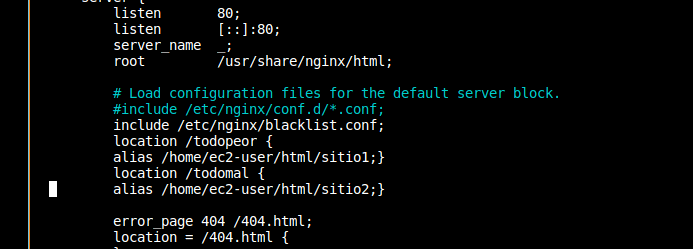
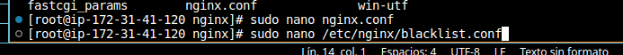
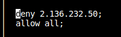
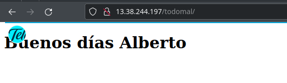
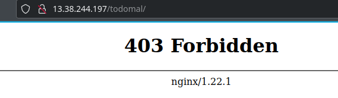
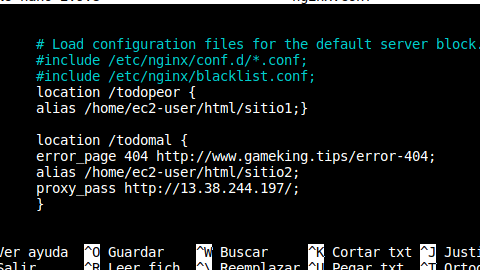
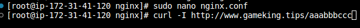
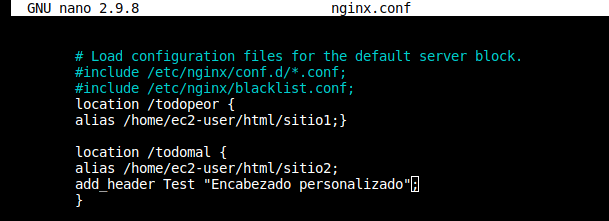

## Nginx - Funcionalidades

## Nginx - Bloqueo de una lista de direcciones IPs

Vamos a configurar el servidor Nginx para bloquear el acceso de una IP.
Vamos a utilizar nuestra Ip pública y comprobar el acceso de nginx antes y después de reinciar el servicio.

###Nginx - Configuración del archivo del servidor

Le hemos incluído al archivo con un include, la ruta que nos dirige al archivo de Ip bloqueadas, que hemos llamado blacklist.configurar

Dentro de ese archivo para bloquear Ips que hemos creado, le añadimos nuestra Ip pública para que la bloquee.

Como vemos,antes de reinciar el sistema tenemos esto:

Ahora reiniciamos el sistema con service nginx restart y probamos a entrar de nuevo.

## Nginx - Redirigir el error 404 a una página

Para empezar editamos el archivo de configuración de Nginx para el sitio web predeterminado.

Ahora volvemos al fichero de configuración de Nginx y le añadimos a la Agregamos al archivo de configuración el código de error.

Ahora solo nos queda reiniciar el servicio con :
    - service nginx restart

Porbamos a intentar acceder a una página que no existe:

En nuestro ejemplo, el error 404 se redirija a una dirección URL específica mediante un código 302.

Hay varias maneras de redirigir una página de error usando Nginx.
## Nginx - Añadir un encabezado personalizado

Para ello en el servidor de Nginx tenemos también que modificar el archivo de configuración de Nginx.

A este archivo le añadimos la siguiente líena de configuración:

De nuevo nos toca reinicar el servicio de nginx 

Y ya estaría agregado el encabezado.

